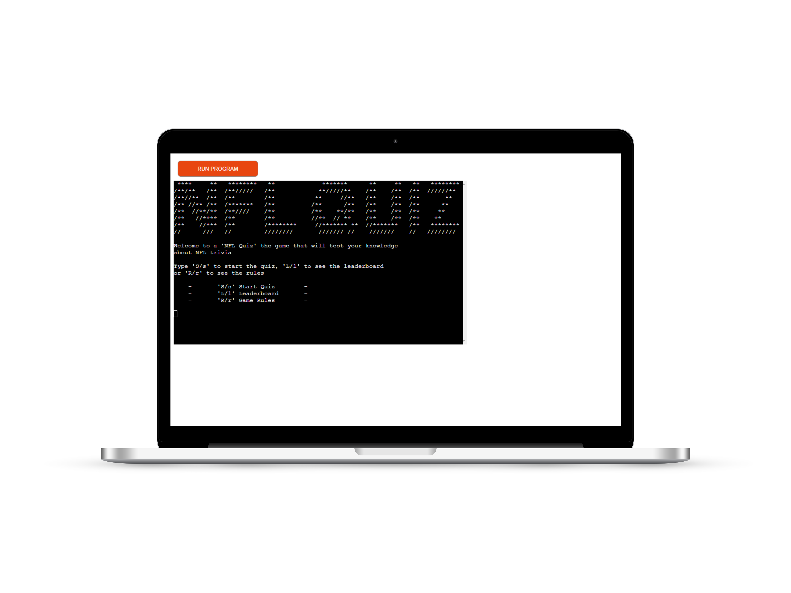
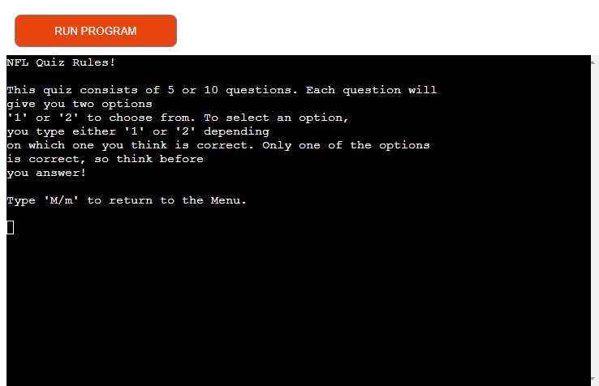
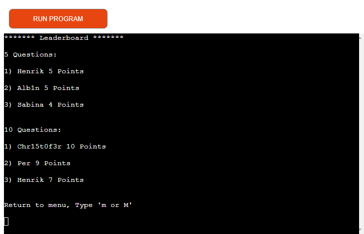
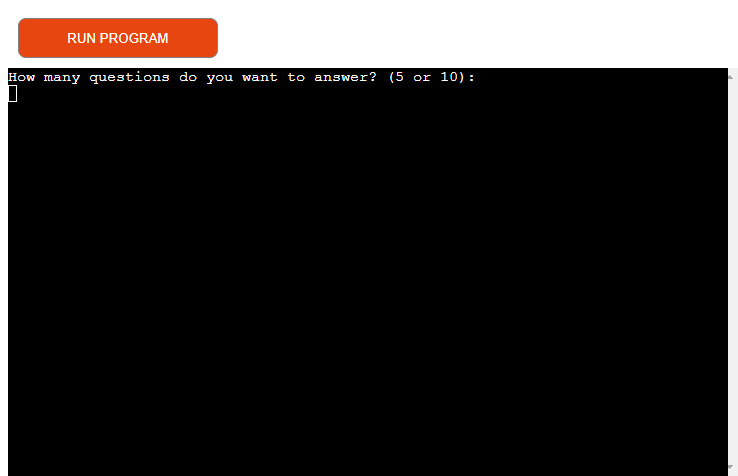
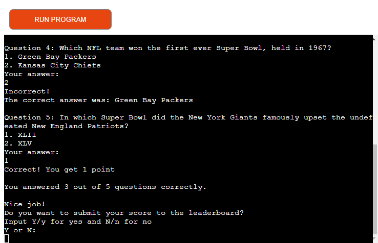

# NFL Quiz Game
NFL Quiz game is a Python based quiz game where user will have to answer NFL trivia questions. The game gives you the option to choose the amount of questions to be played, either 5 or 10. For each question the player is presented with two options, where one is correct and one wrong. If the player answers the question correct, they will get one point. If they get it wrong the game continues to the next question. When the game is finished the player is presented with their finishing score and given the option to submit their final score to the leaderboard.

To play the quiz you can click this [link](https://henriks-nfl-quiz-568e345c5752.herokuapp.com/).

## Intention
This application was created by me with the porpuse of being my Third Portfolio Project for Code Institutes Full Stack Software Development Course. The main criteria for the Third Portfolio Project was to use Python as the coding language.
## Technologies Used
### Languages
* Python was used for the functionality of the program
### Libraries
* [pyfiglet](https://www.geeksforgeeks.org/python-ascii-art-using-pyfiglet-module/) used to generate the logo
* [os](https://www.geeksforgeeks.org/clear-screen-python/) used to clear the terminal
* [time](https://www.programiz.com/python-programming/time/sleep) used for the sleep function
* [gspread](https://docs.gspread.org/en/v3.7.0/api.html) used to link the program to Google Sheet
* [credentials](https://pypi.org/project/credentials/) used to link the program to Google Sheet
* [random](https://docs.python.org/3/library/random.html) used to randomize the order of the questions

## Features
This quiz has 5 main features. The first feature the player is presented with an 'NFL-Quiz" logo that is created using [pyfiglet](https://www.geeksforgeeks.org/python-ascii-art-using-pyfiglet-module/). Under the logo the program displays a menu containing 3 options, see the leaderboard, see the rules of the game or to start the game.

The second main feature is the rules section. If the player selects to view this section the player is shown a text explaining the rules of the game.

The third main feature is the leaderboard section. If the player selects to view this section the player is shown a leaderboard over the top 3 players for the respective amount of questions. This data is stored in a [Google Sheet](https://docs.gspread.org/en/v3.7.0/api.html)-document that acts as a database, that can be read from and also writen to.

The fourth main feature is that you get the option to select if you want to play 5 or 10 questions when you start the game.

The fifth main feature is that the game gives you the option to submit your score to the leaderborad when you are finished playing if you have reached a certain threshold score or higher. For 5 questions this threshold is 2 points or higher and for 10 questions the threshold is 4 points or higher. If the player chooses to submit the score to the leaderboard then the game will also ask the player to input a name. The score together with the name is then sent over to the [Google Sheet](https://docs.gspread.org/en/v3.7.0/api.html)-document.

