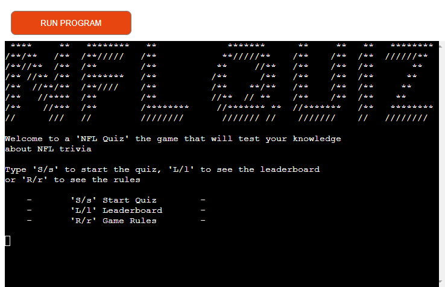

# NFL Quiz Game
NFL Quiz game is a Python based quiz game where user will have to answer NFL trivia questions. The game gives you the option to choose the amount of questions to be played, either 5 or 10. For each question the player is presented with two options, where one is correct and one wrong. If the player answers the question correct, they will get one point. If they get it wrong the game continues to the next question. When the game is finished the player is presented with their finishing score and given the option to submit their final score to the leaderboard.

To play the quiz you can click this [link](https://henriks-nfl-quiz-568e345c5752.herokuapp.com/).

## Intention
This application was created by me with the porpuse of being my Third Portfolio Project for Code Institutes Full Stack Software Development Course. The main criteria for the Third Portfolio Project was to use Python as the coding language.

## Flowchart
When I was thinking about what to do for my project i had a few different ideas but ended up settling on doing this quiz game. With that decided I started to plan out how the program should work and the logic behind it. To help with this I made a flowchart over how I wanted the logic to be.

## Technologies Used
The project is built using a [template](https://github.com/Code-Institute-Org/p3-template) from Code Institute that is tailored for Portfolio Project 3.
### Frameworks & Programs
- **Python**: The core language used for the functionality of the program
- **Git**: Used for version control eg. **`git`** `add - commit - push`
- **Gitpod**: Used as IDE and primary code editor
- **Heroku**: Used for deploying the program
- **Google Sheets**: Used as a database to store data
### Python Libraries
* [pyfiglet](https://www.geeksforgeeks.org/python-ascii-art-using-pyfiglet-module/) used to generate the logo
* [os](https://www.geeksforgeeks.org/clear-screen-python/) used to clear the terminal
* [time](https://www.programiz.com/python-programming/time/sleep) used for the sleep function
* [gspread](https://docs.gspread.org/en/v3.7.0/api.html) used to link the program to Google Sheet
* [credentials](https://pypi.org/project/credentials/) used to link the program to Google Sheet
* [random](https://docs.python.org/3/library/random.html) used to randomize the order of the questions

## Features
This quiz has 5 main features. The first feature the player is presented with an 'NFL-Quiz" logo that is created using [pyfiglet](https://www.geeksforgeeks.org/python-ascii-art-using-pyfiglet-module/). Under the logo the program displays a menu containing 3 options, see the leaderboard, see the rules of the game or to start the game.

The second main feature is the rules section. If the player selects to view this section the player is shown a text explaining the rules of the game.

The third main feature is the leaderboard section. If the player selects to view this section the player is shown a leaderboard over the top 3 players for the respective amount of questions. This data is stored in a [Google Sheet](https://docs.gspread.org/en/v3.7.0/api.html)-document that acts as a database, that can be read from and also writen to.

The fourth main feature is that you get the option to select if you want to play 5 or 10 questions when you start the game.

The fifth main feature is that the game gives you the option to submit your score to the leaderborad when you are finished playing if you have reached a certain threshold score or higher. For 5 questions this threshold is 2 points or higher and for 10 questions the threshold is 4 points or higher. If the player chooses to submit the score to the leaderboard then the game will also ask the player to input a name. The score together with the name is then sent over to the [Google Sheet](https://docs.gspread.org/en/v3.7.0/api.html)-document.

### Future features to add
- Increase the number of questions the game can randomize between. To avoid players from memorizing all answers.
- Increase answer options from 2 to 4. To make it harder to guess the correct answer.

## Testing
I manually tested the code by doing the following:

- Passed the code through a PEP8 linter to check for errors.
- Tried to play the game wrong in many different ways to try and break it, but i din't manage to do it.
- Made many test runs to see that score was calculated correctly and that data was read and sent to the google sheets document. 
- Asked friends and family to visit the deployed Heroku site to see if they could find any bugs or break it in any way.

Results from PEP8 test:

The two error codes that the code linter points out, are two different functions that are longer than 79 characters. Unfortunately i did not have the time to find a solution for this. But his does not effect the function of the program since its not a visual thing but rather soething that happens in the background.

## Deployment

### Via Heroku

<strong>Click to view Heroku's deployment instructions</strong>

1. **Sign Up/Login to Heroku**
    - Sign up for a Heroku account at [Heroku](https://www.heroku.com/) or log in if you already have an account.

2. **Create a New App on Heroku**
    - Once you have logged in, navigate to your Heroku dashboard and click on the 'New button', then select 'Create new app'.
    - Choose a unique name for your app and select the region closest to your location.

3. **Connect GitHub Repository**
    - After creating your app, navigate to the Deploy tab in your app's dashboard.
    - Under the Deployment method section, select 'GitHub' as the deployment method.
    - Search for your GitHub repository in the Connect to GitHub section and click Connect.

4. **Configure Deployment Options**
    - Once connected, choose the branch you want to deploy (e.g. *main*) and optionally enable automatic deploys for future commits.

5. **Select Framework**
    - Since the Contact Manager includes both Python and Node.js components, you need to specify the correct buildpacks for deployment. 
    - Under the *Settings* tab of your Heroku app, navigate to the 'Buildpacks' section and add the appropriate buildpacks for Python and Node.js.
   (It's important that the Python buildpack is first in the list)
    - Under the section 'Config Vars' add the following environment variables
    - Type 'CREDS' in the 'key' field and in the next field(Value) enter your own Google Credentials from the 'CREDS.JSON' file.
    - Type 'PORT' in the 'Key' field an in the next field(Value) enter 8000.

6. **Deploy Branch**
    - After configuring the deployment options, manually deploy your application by clicking the **Deploy Branch** button.

7. **Monitor Deployment Progress**
    - Heroku will start deploying your application from the selected GitHub branch. You can monitor the deployment progress from the activity log on the same page.

8. **View Application**
    - Once the deployment is complete, Heroku will provide you with a URL to access your deployed application. Click on **View** button to open your application in a new tab.

9. **(Optional) Automatic Deploys**
    - In the 'Deploy' tab there is an option to enable 'Automatic Deploys'. This will deploy a new version of the app automaticlly every time there is a push to `main`

## Credits
- **Stack Overflow**: A online community for developers to ask questions, share knowledge and projects.
- **Tutor support**: Thank you to Code Institutes Tutor Support team. 